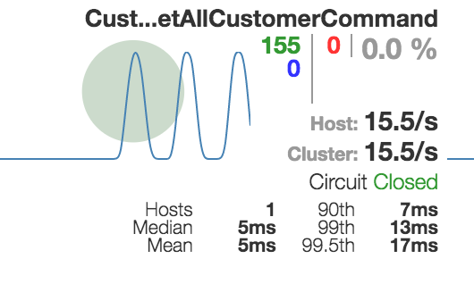
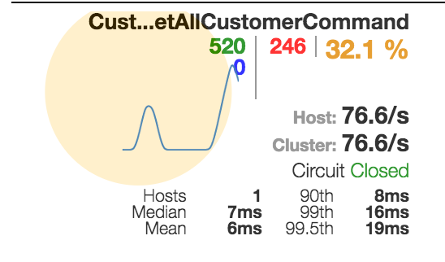

### Getting started

In this tutorial, we will create two micro-services, a backend service and a facade service calling the backend service.

We will see:

- How to create a new service
- How to generate a proxy class for calling another micro-service
- How to display monitoring with hystrix dashboard
- How to add fallback response for providing compensation when a service is down

#### Prerequisites

- node >= 6.0 see [this link](https://nodejs.org/en/download/) to install node on your machine.
- docker version >= 1.12. See [this link](https://docs.docker.com/engine/installation/) to install docker.
- **vulcain-cli** You can install it with

```bash
npm install vulcain-cli -g
```

### Creating the backend service

Creating a new microservice project is easy with **vulcain-cli**. The following command creates a new project
from a template. This template provides a sample customer management service.

```bash
vulcain create customers-service
```

This template is fully operational, you can go to the code, and test it directly in local mode
using ```http://localhost:8080/api``` with curl or postman.

!!!info
    Vulcain templates are predefined to be used with [vscode](https://code.visualstudio.com/) or [webstorm](https://www.jetbrains.com/webstorm/).

Try some urls to see how **vulcain** works:

| url (prefixed with localhost:8080) | Http Verb | Description |
|-----|-----|---|
| /api/_servicedescription | GET | Show service description (metadata) |
| /api/_servicedependencies | GET | Show service dependencies (metadata) |
| /api | GET | Display all customers (this is the default behavior) |
| /api/customer.all | GET | Idem |
| /api/customer.create | POST | Create a customer (see below) |
| /api/customer.delete | POST | Delete a customer |
| /api/customer.update | POST | Update a customer |

> Go to [concepts](../reference/index) to see more infos on the vulcain protocol.

Now we can publish this service in a local demo swarm cluster.

```bash
docker build -t customers-service:1.0 .
vulcain run customers-service:1.0
```

!!!info
    you can also use ./build.sh 1.0 to build the service.

> ```vulcain run``` initializes a swarm cluster if any and create a net-vulcain network and create a new docker service.

The service is now available with a new exposed port (30000 if this is the first service in your swarm cluster). This port is displayed when the vulcain run command ends.

Let's try to create some customers using this new port using the ```customer.create``` action.
E.g.

```sh
curl -XPOST localhost:30000/api/customer.create -d '{"firstName":"Albert", "lastName": "Einstein"}' -H 'Content-Type: application/json'
```

You can list all customers with /api/customer.all (or /api).

!!!warning
    By default, data is stored in memory and will be lost if you restart the container.


### Creating the facade service

We will now create a new facade service exposing a customer with an additional fullName property.

Create a new service facade-service.

```bash
vulcain create facade-service
```

Then open the project and remove the ```src/api/samples``` folder to start with a new clean project.

The first thing to do is to create a model. A model (or schema) describes data manipulated by the service. It offers many
capabilities:

- For input data, it is used to check and validate argument values (raising a 400 bad request error if any errors)
- For storing data, it can be used by the **default** provider to get some persistance information like key definition, uniqueness, collection name...
- For metadata description, it is used to display information (with /api/_servicedescription) usefull to code generation or other tools.

Create a new file /src/api/model.ts and copy/paste the following code:

```csharp
import { Property, Model } from "vulcain-corejs";

@Model()
export class CustomerView {
    @Property({ type: 'string' })
    fullName: string;
    @Property({ type: 'string' })
    firstName: string;
    @Property({ type: 'string' })
    lastName: string;
}
```

This is a very basic model, it has the properties of a customer with an additional fullName property.
Since this model will be used for output response, no validation is added.

Now we will create an handler to query a customer view.

```csharp
import { QueryHandler, Query, AbstractQueryHandler, Command, ServiceDependency, AbstractServiceCommand, IHasFallbackCommand } from "vulcain-corejs";
import { CustomerView } from "./model";
import { CustomersService, Customer } from "./customersService10";

@QueryHandler({ scope: '?' })
export class MyQueryHandler extends AbstractQueryHandler {

    @Query({ description: "Get a list of customers", outputSchema: CustomerView })
    async CustomerViewsAsync() {
        let customersService = new CustomersService(this.requestContext);
        let customers = await customersService.getAllCustomerAsync();
        return customers.map(c => {
            return {
                firstName: c.firstName,
                lastName: c.lastName,
                fullName: c.firstName + ' ' + c.lastName
            };
        });
    }
}
```

#### Handler anatomy

- An handler is just a class with annoted methods. These annotations describe how the handler can be requested. There are 3 kinds of handler: ```Query handler```, ```Action handler``` and ```Event handler```. See [concepts](../reference/index)
- The ```QueryHandler``` annotation tells that the class exposes handler(s) for query (accessible with a GET http verb) and can define default configurations. In this case, the handler could be requested by any (anonymous) user thanks to the ```scope:'?'``` property.
- The ```Query``` annotation is used to expose a method. Annotations have mandatory properties used to describe the service. The query will be accessible from ```/api/customersview``` (The name is inferred from the method name and removing the Async suffix).
- The handler code is like any traditional method. With some specificities:
    - It can take only one argument described by a model. This model will be validated before the method is called and raise a Bad Request error in case of errors.
    - The return value must be described by a model (can be the same as the input argument). This is used to describe the service.
    - If any error occurs, a 500 http error will be sent to the client.

You can note that the service uses a custom service class (```CustomersService```) to read all customers. This is a proxy class requesting our first service : customers-service.

But how can i create this proxy class ?

### Communication between services

Thanks to the metadata description hability of any vulcain service, we can use dedicated tooling to generate code. Code generation uses template to generate a static class with typed method sending request that are high tolerance, monitored and vulcain compatible.

Vulcain compatible means context propagation : security context, global correlation id, tenant information...

To generate the proxy class, we need some information:

- Address of the target service. In our case, localhost:30000
- A template to use, by default this is microServiceProxy (for generating vulcain proxy). The other template is angularServiceProxy to generate proxy class for angular application.
- The folder where the generated file will be saved. Default is the current folder.

To generate the class, type the following code from the application root folder.

```sh
vulcain generate --address localhost:30000 --folder src/api
```

The proxy class encapsulates all requests into [hystrix commands](https://github.com/Netflix/Hystrix) providing circuit breaker, timeout, bulkhead and monitoring.

Now you can compile and test the service locally with:

```sh
curl http://localhost:8080/api/customersview
```

Result depends of how many customers you created before, but note the standardized response format.

### Monitoring command request with hystrix dashboard

To enable hystrix monitoring, just set the variable ```enableHystrixStream``` to ```true``` in startup.ts.

To visualize metrics, we need to start hystrix dashboard with the following command:

```sh
docker service create --network net-vulcain -p 9999:9002 --name hystrix-dashboard mlabouardy/hystrix-dashboard:latest
```

Then open the dashboard on ```http://localhost:9999/hyxtrix```, set the service endpoint with ```http://<host ip>:8080/hystrix.stream``` and click on __Monitor Stream__.

You can test monitoring by calling many requests.
For example with :

```sh
ab -n 200 http://localhost:8080/api/customersview
```

You must see something like this:



!!!info
    Note how the service ip address changes depending on where you call it. To test the service, you can use ```localhost``` but since hystrix is running within a container you must provide the host ip.

    If the service were deployed as a swarm service, you can access it with a standardized DNS name corresponding to the service name + its version (removing all special characters).

    For example, if you deploy the service with ```vulcain run service-facade:1.0```, you can monitor it with the address ```http://servicefacade10:8080/hystrix.stream```.

### Failure compensation

Calling microservice over http is not a long quiet stream, many errors can occur and you must be prepared for this.
For this situation, **vulcain** uses an hystrix implementation of command. You can configure the command behavior with annotation. For example, the following command has a 1500ms timeout protecting from long requests.

This is the microservice philosophy : Service can failed but quickly.

For most scenarii, if the request failed it's better to send a default response than an error message. This is the role of the compensation (fallBack) method.

> You can try a request failure by removing the backend service with ```docker service rm customersservice10``` and by requesting the facade service. Due to the default 1500ms timeout, errors will occur quickly. You can see it in hystrix dashboard.



Before adding a compensation, we need to understand how the service proxy class works. This class provides a method for each endpoints (handlers) of the target service. Every time a call is made to an endpoint, a (hystrix) command is created by the proxy to encapsulate this call. By default, all calls of the same proxy use the same command named ```<service name>Command```.

If you need to customize a call, you need to customize a command but only for this specific call. To do that, the proxy class will check for every call if a specific command exists for this call otherwise it will use the default command. A specific command is identified by a name like ```<service name><method name>Command```.

Since we will customize a call to ```getAllCustomerAsync``` of the proxy class named ```CustomersService``` we need to create a new command named ```CustomersServiceGetAllCustomer``` (Async is always removed for naming).

To add compensation we need to provide a ```fallback``` method returning the default value.

You can now create a new file in src/api/ containing the following code.

```csharp
@Command({ executionTimeoutInMilliseconds: 1500 })
@ServiceDependency('customers-service', '1.0', 'http://localhost:32772/api/_servicedescription')
export class CustomersServiceGetAllCustomerCommand extends AbstractServiceCommand
    implements IHasFallbackCommand<Customer[]> {
    async fallbackAsync(): Promise<Customer[]> {
        return [{
            firstName: "John", lastName: "Lennon"
        }];
    }
}
```

Annotations are copied from the default generated command. You can see how to set timeout delay and how to define informations used for service description.

Fallback method is called on every error during the request including timeout.

Now if you request the facade service, the compensation response will be returned.

