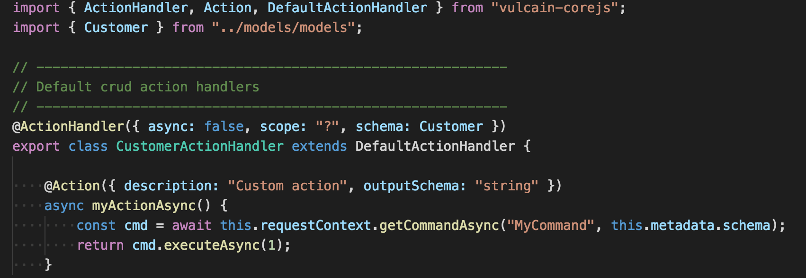

    

        
 
            
        

    

    

        

            Open-Source Microservice Framework for nodejs (Preview) 
        

    

    

        

            <a href="https://github.com/vulcainjs/vulcain-corejs/zipball/master" class="btn btn-default btn-lg btn-block" style="padding: 14px 16px;">Download</a>
        

        

            <a href="http://github.com/vulcainjs/vulcain-corejs" class="btn btn-success btn-lg btn-block"  style="padding: 14px 16px;">View On GitHub</a>
        

    

    

        <h4>Features</h4>
        

            <ul>
            <li>Fully docker deployable</li>
            <li>Hystrix command implementation (circuit-breaker, bulkhead, timeout)</li>
            <li>Context propagation (user context, correlation id...)
            <li>CQRS implementation</li>
            <li>Fully extensible whith adapters</li>
            <li>Input data validation</li>
            <li>Default implementation (MongoDb, rabbitmq, statsd, swarm)</li>
            <li>Authoring tool (Creating project from template, code generation...)</li>
            <li>Metrics generation</li>
            </ul>
        

    

    

        <h4>Enterprise ready</h4>
        

            <ul>
            <li>Dynamic configuration properties</li>
            <li>Service versionning</li>
            <li>Feature teams and domains</li>
            <li>Environment management</li>
            <li>Built-in metadata service description (entry points description, service dependencies)</li>
            <li>Log obfuscation for sensible data</li>
            <li>User interface management for teams</li>
            <li>Automatic metrics generation</li>
            <li>Multi-tenants</li>
            <li>Distributed request log aggregation with correlation-id</li>
            </ul>
        

    

    

        <h4>Video overview</h4>
        

            <iframe width="340" height="200" src="https://www.youtube.com/embed/LAQK-ZjW124" frameborder="0" allowfullscreen></iframe> 
        

    

